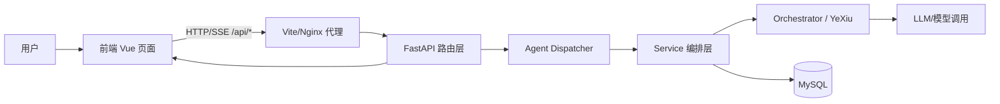

# AI 助教系统整体调用框架

## 1. 总览

本项目采用 **前后端分离** 架构：

- 前端：Vue 3 + Vite，负责页面展示、用户交互、SSE 流式渲染。
- 后端：FastAPI，负责路由分发、Agent 调度、业务编排、数据库读写、模型调用。
- 数据层：MySQL（会话、消息、学习记录等）。
- 模型层：LLM（对话/学习推理）、语音识别与语音合成。

---

## 2. 端到端调用主链

---

## 3. 前端调用框架

### 3.1 应用入口

1. `main.js` 初始化 Vue、Pinia、Router。  
2. `App.vue` 通过 `router-view` 承载各页面。  
3. `router/index.js` 分发到 `LoginView`、`LearningView`、`MathView`、`AdminView` 等。

### 3.2 API 调用模式

- 普通请求：`fetch('/api/...')`。
- 流式请求：SSE（`/api/chat/stream`、`/api/learn/stream`），前端按 `data:` 行解析 `chunk/end/error`。
- 开发环境：Vite 代理 `/api -> 127.0.0.1:8000`。

### 3.3 关键前端模块

- 聊天主界面：`src/components/Chat.vue`
- 学习流式封装：`src/composables/useLLMStream.js`
- 管理端鉴权头封装：`src/utils/api.js`

---

## 4. 后端调用框架

### 4.1 入口与路由聚合

1. `backend/main.py` 创建 FastAPI，注册生命周期（模型预加载）与全局中间件。
2. `app/api/router.py` 聚合子路由：
   - `chat.py`
   - `learn.py`
   - `math_learn.py`
   - `admin.py`
3. `main.py` 同时挂载记忆路由 `spaced_api.py` 与认证、语音、WebSocket 端点。

### 4.2 Chat/学习链路

#### A. 聊天流式链路

`/api/chat/stream`  
→ `agent_dispatcher.stream(...)`  
→ 根据 mode/关键词路由到 `chat_agent` 或 `learn_agent`  
→ `chat_service.handle_stream_chat_request(...)`  
→ LLM 流式返回  
→ SSE 推送前端。

#### B. 学习流式链路

`/api/learn/stream`  
→ `learn_agent.stream(...)`  
→ `YeXiuLearningAgent.stream_learning_process(...)`  
→ 依次经过分解/思考/教练/复盘/策略等阶段  
→ 返回结构化过程数据与文本流。

### 4.3 服务编排与领域路由

- `app/agents/dispatcher.py`：统一入口，负责 mode 选择和自动切换 learn。
- `app/services/chat_service.py`：对话保存、深度思考、流式输出。
- `app/services/learn_service.py`：学习任务编排、反馈评估、产物提取。
- `app/core/orchestrator/*`：学习/数学/普通意图路由与执行链。
- `app/core/yexiu/*`：YeXiu 多智能体协同框架。

---

## 5. 数据与状态流

### 5.1 会话与消息

- 前端携带 `username + conversation_id`。
- 后端通过 `chat_service -> user_repo` 读写会话与消息。
- 会话接口：
  - `GET /api/chat/sessions`
  - `POST /api/chat/sessions`
  - `GET /api/chat/sessions/{id}/messages`

### 5.2 鉴权

- 登录接口：`/api/auth/login`
- 前端保存 token 到 localStorage
- 管理端接口通过 `Authorization: Bearer <token>` 访问
- 后端 `get_current_user` 解码校验 JWT。

---

## 6. 语音调用链

### 6.1 语音识别（ASR）

前端上传音频  
→ `POST /api/speech/recognize`  
→ `model_manager` 获取 SenseVoice 模型  
→ 推理与后处理  
→ 返回识别文本。

### 6.2 语音合成（TTS）

文本  
→ `GET /api/speech/tts`  
→ edge-tts 生成音频  
→ 返回 mp3 文件流。

### 6.3 全双工语音

前端 WebSocket  
→ `/ws/duplex`  
→ VAD + ASR + LLM + TTS 分段回传。

---

## 7. 调用框架一页版（适合二次开发）

1. **前端入口**：路由页面触发 API/SSE。  
2. **后端入口**：`main.py` + `api_router` 统一接入。  
3. **分发层**：`dispatcher` 根据 mode/意图选 Agent。  
4. **编排层**：`chat_service / learn_service / orchestrator / yexiu` 串联业务。  
5. **能力层**：LLM、ASR、TTS、记忆模块。  
6. **数据层**：`user_repo/mysql_repo` 持久化会话、消息、学习数据。

